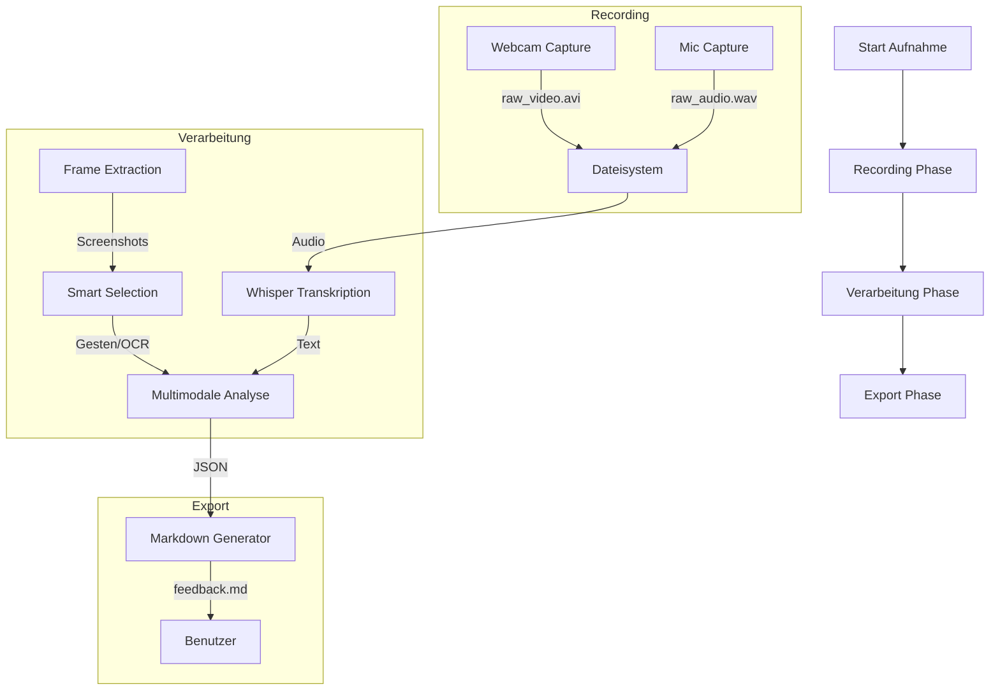

# Datenfluss (Data Flow)

Dieses Dokument beschreibt den detaillierten Datenfluss innerhalb der `multimedia-feedback-coding` Anwendung, von der Aufnahme bis zum finalen Export.

## Übersicht der Pipeline

## 1. Recording Phase (Aufnahme)
- **Input:** Multimedia-Streams (Video von Webcam/GoPro, Audio vom Mikrofon).
- **Technik:** 
    - `OpenCV` (cv2) liest Videoframes aus.
    - `sounddevice` liest Audiopuffer aus.
    - `PyQt6` Threads verarbeiten die Puffer ohne die GUI zu blockieren.
- **Output:** 
    - `raw_video.avi`: Rohvideo im MJPG Format.
    - `raw_audio.wav`: Unkomprimiertes PCM Audio.
- **Location:** `.extraction/` Verzeichnis innerhalb des jeweiligen Screen-Ordners.

## 2. Verarbeitungs-Pipeline (Processing)
Sobald eine Aufnahme beendet wird (oder beim Wechsel zum nächsten Screen), startet der `PipelineWorker`.

### 2.1 Frame Extraction
- Der `FrameExtractor` nutzt `OpenCV`, um das `raw_video.avi` in Einzelbilder zu zerlegen.
- Standardmäßig wird 1 Frame pro Sekunde extrahiert.

### 2.2 Smart Selection (Gesten & OCR)
- **Gesture Detection:** Nutzt `MediaPipe`, um Zeigegesten (Pointing) in den Frames zu finden.
- **Manual Annotations (Brush):** Der Benutzer kann Gebiete direkt in der App markieren. Der `AnnotationAnalyzer` identifiziert diese Regionen, crawlt sie mit OCR ab und fügt sie dem Bericht hinzu.
- **OCR:** Nutzt `EasyOCR` oder `PaddleOCR`, um Textänderungen oder Schlüsselbegriffe zu identifizieren.
- **Ziel:** Nur die relevantesten Frames für die KI-Analyse auszuwählen.

### 2.3 Transkription
- Das `raw_audio.wav` wird an die OpenAI Whisper API gesendet.
- **Output:** JSON-Transkript mit Timestamps.

## 3. Multimodale Analyse
- **Input:** Die selektierten Frames + das Transkript + Metadaten (Viewport, Route).
- **Prozessor:** `MultimodalAnalyzer` sendet Daten an LLMs (GPT-4o, Llama 3.2 Vision via OpenRouter/Replicate).
- **Analyse:** Die KI vergleicht das Gesagte mit dem Gesehenen und identifiziert Usability-Probleme.

## 4. Export Phase
- Alle Ergebnisse werden in einer zentralen `analysis.json` im Projektordner gesammelt.
- Der `Exporter` erstellt daraus eine strukturierte `feedback.md` Datei, die Screenshots und KI-Feedback kombiniert.

## Verwendete Formate
- **Video:** `.avi` (MJPG)
- **Audio:** `.wav` (PCM 16-bit, 44.1kHz)
- **Bilder:** `.png`
- **Metadaten:** `.json`
- **Endbericht:** `.md` (Markdown)
